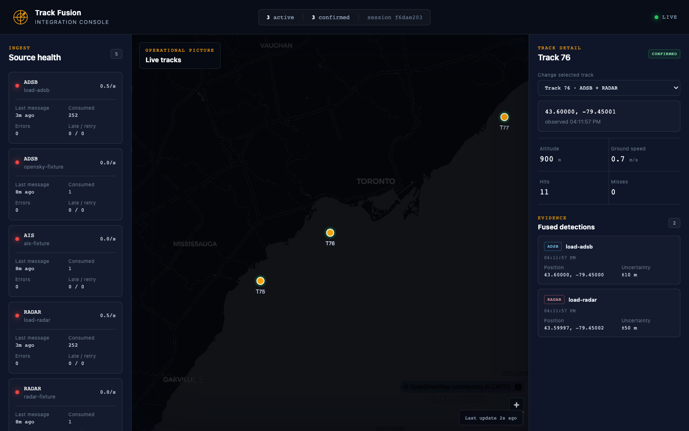
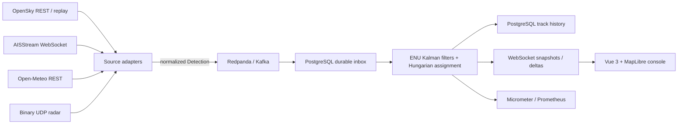

# Multi-Source Track Fusion & Integration Platform

[](https://github.com/RyanSXing/Multi-Source-Track-Fusion-Integration-Platform/actions/workflows/ci.yml)

A Java 21 integration platform that normalizes heterogeneous public sensor feeds, correlates detections in local ENU coordinates, and streams durable fused tracks to a Vue 3 operator console.



## Architecture



The active service instance holds a PostgreSQL advisory lock. A durable leadership epoch fences stale writers during failover, while Kafka records are staged and deduplicated in PostgreSQL before fusion. See [the design review](docs/DESIGN.md) for delivery semantics and trade-offs.

## Quickstart

Requirements: Docker with Compose. For local development, use Java 21+, Node 24+, Maven Wrapper, and Python 3.

```bash
cp .env.example .env
docker compose up --build -d
curl http://localhost:8080/actuator/health
```

Open:

- Operator console: <http://localhost:3000>
- Current tracks: <http://localhost:8080/api/tracks>
- Source health: <http://localhost:8080/api/sources/health>
- Prometheus metrics: <http://localhost:8080/actuator/prometheus>

The default profile emits deterministic ADS-B, AIS, and radar fixtures so the full pipeline is visible without credentials. Stop it with `docker compose down`; add `-v` only when you intentionally want to delete local track history and Kafka data.

## Live sources

Copy `.env.example` to `.env`, disable fixtures, and enable only the feeds you need:

```dotenv
FIXTURE_SOURCES_ENABLED=false
OPENSKY_ENABLED=true
AISSTREAM_ENABLED=true
AISSTREAM_API_KEY=replace-me
RADAR_ENABLED=true
OPEN_METEO_ENABLED=true
```

The adapters implement:

| Source | Transport | Resilience / normalization |
|---|---|---|
| OpenSky ADS-B | Polled REST JSON | rate-limit-aware retry and normalized uncertainty |
| AISStream | WebSocket JSON | subscribe handshake and exponential reconnect |
| Open-Meteo | REST JSON | rounded-grid TTL cache and track enrichment |
| Simulated radar | binary UDP | bounded codec, noise, latency, dropout, and false-target controls |

All live adapters are wrapped in Resilience4j circuit breakers. The radar UDP port defaults to `5005`.

## APIs and operations

| Endpoint | Purpose |
|---|---|
| `GET /api/session` | Current tracking session UUID |
| `GET /api/tracks` | In-memory active snapshot |
| `GET /api/tracks/{id}/history` | Reactive PostgreSQL history stream |
| `GET /api/sources/health` | Per-source rates, errors, retries, and last message |
| `WS /ws/tracks` | Initial full snapshot followed by versioned deltas |
| `GET /actuator/prometheus` | Source, latency, active-track, persistence, JVM, and CPU metrics |

Important custom metrics include `track_fusion_source_events_total`, `track_fusion_source_latency`, `track_fusion_end_to_end_latency`, `track_fusion_active_tracks`, and `track_fusion_persistence_errors_total`.

## Build and test

```bash
./mvnw verify
cd tf-console && npm ci && npm run build
```

`mvn verify` enforces line coverage of at least 85% in both core modules. The current measured reports are:

| Module | Line coverage |
|---|---:|
| `tf-common` | 87.73% (143/163) |
| `tf-fusion` | 91.63% (383/418) |

The integration suite uses real PostgreSQL and Redpanda Testcontainers. It covers adapter publication through Kafka, durable inbox staging, event-time fusion, persisted history, leadership loss, epoch-fenced takeover, and stale-writer rejection.

## Measured load run

The Python harness sends recorded normalized detections through `rpk`, observes published WebSocket tracks, samples Prometheus CPU, and writes JSON:

```bash
python3 -m venv .venv
.venv/bin/pip install -r tools/requirements.txt
.venv/bin/python tools/load_harness.py --cycles 40 --multiplier 20
```

Measured on Docker Desktop on 2026-07-27:

| Run | Input | Producer throughput | Delivery | p99 latency | Average process CPU | Duplicate reduction |
|---|---:|---:|---:|---:|---:|---:|
| Stress | 240 | 100.62 msg/s | 100% | 3663.18 ms | 5.58% | 50% |
| Isolated fusion baseline | 12 | 9.25 msg/s | 100% | 3419.71 ms | 2.65% | 50% |

The reports are committed at [load-latest.json](tools/reports/load-latest.json) and [fusion-baseline.json](tools/reports/fusion-baseline.json). The harness requires complete delivery and clean historical ground-truth integrity; both runs retained three pure fused tracks for three objects. The fixed one-second event-time tick plus two-second lateness allowance dominates latency. These are measured results, not resume targets.

## Repository layout

```text
tf-common/    Detection schema, coordinate conversion, radar codec
tf-adapters/  Four source integrations, replay, and radar simulator
tf-fusion/    Framework-free Kalman filter, association, lifecycle
tf-service/   Spring WebFlux, Kafka, R2DBC, WebSocket, metrics
tf-console/   Vue 3 and MapLibre operator console
tools/        Replay/load harness and measured JSON reports
docs/         Design review, test plan, sprint notes, and ADRs
```

CI definitions are provided for GitHub Actions, GitLab CI, and Jenkins with the same build, test, coverage, integration, and package stages. A GitLab mirror or hosted Jenkins result should only be claimed after those external pipelines have actually run.

## Documentation

- [Design review](docs/DESIGN.md)
- [Formal test plan](docs/TEST_PLAN.md)
- [Sprint record](docs/SPRINTS.md)
- [Architecture decisions](docs/adr/)

This project uses only public data and synthetic radar inputs. It is a general integration and tracking demonstration, not a military system.
