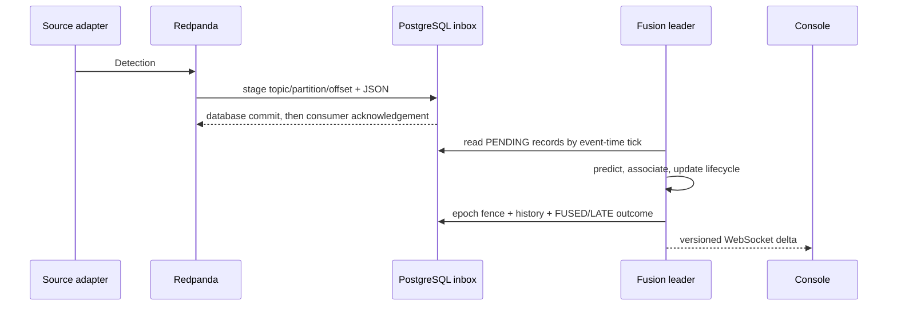

# Design Review

## Purpose and requirements

The platform must ingest incompatible real-time sources without allowing one failing feed to stop the rest, convert their data into one validated schema, correlate observations of the same object, retain an auditable history, and publish a live operational view. The core fusion code must remain framework-free and testable. Runtime delivery must survive consumer redelivery, database failure, process restart, and active-instance loss without silently duplicating durable outcomes.

## System boundaries

Adapters own transport parsing, source identity, uncertainty, retry, and circuit breaking. Their only output is `Detection`. Kafka separates unreliable external I/O from deterministic fusion. The service owns durable inbox processing, event-time windows, persistence, REST/WebSocket interfaces, leadership, and metrics. The console is a read-only projection.



## Normalized model and coordinates

`Detection` carries both `observedAt` and `receivedAt`, WGS84 position, optional motion/altitude, a source uncertainty in metres, and source attributes. Validation occurs in the record constructor. Fusion converts WGS84 to a local East/North/Up tangent plane before distance, covariance, or velocity calculations; latitude/longitude degrees are never treated as linear units.

The reference origin is configurable. A regional tangent plane is intentionally simpler than Earth-centred tracking and is accurate for the configured operating area. A global deployment would partition by region or replace this transform.

## Fusion

Each track uses a constant-velocity Kalman state `[x, y, vx, vy]`. Prediction runs on a fixed event-time tick. Measurement covariance comes from `positionSigmaMeters`, so accurate ADS-B observations influence the result more than noisy radar observations.

Association computes squared Mahalanobis distance, rejects pairs beyond the configured chi-square gate (`9.21` by default), and solves the remaining global minimum assignment with the Hungarian algorithm. Deterministic ordering removes input-order dependence. Unassigned cross-source detections that fall inside the gate seed one fused track rather than one track per sensor.

Lifecycle defaults are 3 hits in a 5-tick confirmation window and drop after 5 misses:

```text
TENTATIVE -> CONFIRMED -> COASTING -> DROPPED
```

## Event time and delivery

Kafka consumer batches are first inserted into `processed_kafka_records` using `topic:partition:offset` as the primary key. A redelivery therefore becomes a harmless duplicate. The scheduler groups all pending records into one-second event-time ticks and waits for a two-second lateness watermark. Cross-poll detections in the same tick can still fuse.

History rows and inbox outcomes commit in one reactive PostgreSQL transaction. Failed persistence retains the exact pending tick membership for retry. New same-tick arrivals cannot alter the failed transaction's replay; after it succeeds, later arrivals are classified `LATE`. This gives deterministic database effects without coupling PostgreSQL and Kafka into a distributed transaction.

## Leadership and failover

Only one instance may mutate fusion state. It holds a dedicated PostgreSQL connection with an advisory lock and advances the durable `fusion_leadership` epoch. Every history/inbox transaction locks and verifies that epoch and session. A takeover therefore waits for an in-flight commit, and a disconnected old leader cannot commit after the new epoch is active. Once leadership is lost, that service instance retires permanently instead of attempting to reacquire with stale in-memory state.

Reads and the console remain available on standby instances, but this version does not replicate the active in-memory tracker to them. A takeover starts a new session UUID and track IDs continue above persisted history.

## Interfaces

REST exposes current tracks, per-track history, session identity, and source health. WebSocket clients receive an initial full snapshot and versioned deltas, plus periodic snapshots for recovery. Slow clients use latest-value backpressure. The Vue console resets state when the session changes and renders source/state layers directly from GeoJSON in MapLibre.

## Observability

Micrometer records per-source adapter, publish, consume, redelivery, late, error, and circuit events; source and end-to-end latency histograms; active tracks; persistence errors; WebSocket emission errors; and standard JVM/process metrics. `/actuator/health` exposes readiness/liveness and `/actuator/prometheus` is scrapeable.

## Alternatives considered

| Decision | Alternative | Reason not chosen |
|---|---|---|
| Kafka/Redpanda boundary | Direct `Flux` from adapters to fusion | Smaller, but loses replay, backpressure isolation, and a durable integration seam |
| Local ENU plane | Fuse latitude/longitude degrees | Mathematically invalid distance/covariance and latitude-dependent scale |
| Hungarian assignment | Greedy nearest neighbour | Input-order dependent and can miss the global minimum under crossing tracks |
| PostgreSQL inbox | Commit Kafka offset before database work | Can lose detections after acknowledgement |
| Database epoch fence | Advisory lock only | A severed session may still have an in-flight transaction during takeover |
| Reactive R2DBC | Blocking JDBC | Would block WebFlux paths or require a separate executor |
| One active fusion leader | Distributed tracker state | Considerably more coordination; unnecessary for the current throughput target |

## Known ceilings and next triggers

- Hungarian assignment is cubic in the larger side of the cost matrix. Partition spatially when a tick contains enough detections to make association the measured bottleneck.
- Repeated same-source/object observations are coalesced inside each tick when a stable feed identity is present. Identity-less high-rate observations remain distinct; require a source identity contract before using those feeds at above-tick rates.
- PostgreSQL history is append-only and unbounded. Add retention/partitioning when operational retention requirements exist.
- The basemap uses CARTO tiles over the public internet. Host an internal style/tileset for offline deployments.
- Authentication and authorization are outside this public demo's scope. Add them before exposing write or sensitive endpoints.
